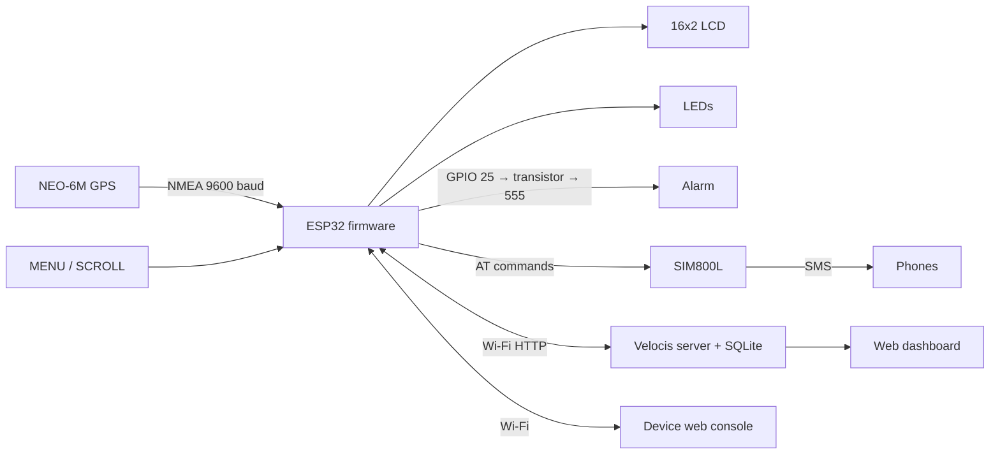

# Velocis GPS Speed Monitor — User Manual

Velocis is a vehicle speed monitor. A small box in the car reads GPS, compares your speed with the speed limit, warns the driver with lights and a buzzer, texts (SMS) chosen phone numbers on serious speeding, and reports everything to an online dashboard where you can see the vehicle on a map, its route history, and all violations.

**Online dashboard:** [shot.do/x9yPtz](https://shot.do/x9yPtz)

---

## Contents

1. [What's in the box](#1-whats-in-the-box)
2. [First-time setup](#2-first-time-setup)
3. [The LCD screen](#3-the-lcd-screen)
4. [The two buttons](#4-the-two-buttons)
5. [Lights and buzzer](#5-lights-and-buzzer)
6. [Device web console](#6-device-web-console)
7. [Online dashboard (server)](#7-online-dashboard-server)
8. [SMS alerts](#8-sms-alerts)
9. [Google Maps links](#9-google-maps-links)
10. [Power saving (parked sleep)](#10-power-saving-parked-sleep)
11. [How it works](#11-how-it-works)
12. [Troubleshooting](#12-troubleshooting)
13. [Reference](#13-reference)

---

## 1. What's in the box

| Part | What it does |
|---|---|
| ESP32 board | The brain: runs the firmware, Wi-Fi, web console |
| NEO-6M GPS module | Position and speed (needs open sky) |
| SIM800L GSM module + SIM | Sends SMS alerts (SIM needs credit, no PIN) |
| 16×2 LCD (I²C) | Live speed, limit and status |
| Green / yellow / red LEDs | At-a-glance status |
| Buzzer (555 alarm stage) | Audible speeding alarm |
| MENU and SCROLL buttons | Change screens, mute, set limit, setup |

---

## 2. First-time setup

### 2.1 Power on

The LCD shows `Velocis v1.4 / Starting...`, then `Network Setup`, then `Init GSM...`. This takes up to ~30 seconds.

### 2.2 Connect the device to Wi-Fi

On first boot (or any time no Wi-Fi is saved) the device creates its own hotspot and the LCD cycles through these instructions:

| LCD shows | Meaning |
|---|---|
| `WiFi Setup Mode` / `Scan QR on phone` | Setup mode is active |
| `Hotspot name:` / `GPS-SpeedMonitor` | Join this Wi-Fi on your phone |
| `Pass:speed1234` / `192.168.4.1` | Hotspot password and address |
| `Open in browser` / `192.168.4.1/wifi` | Page to open |

1. On your phone, join Wi-Fi **GPS-SpeedMonitor**, password **speed1234**.
2. Open **http://192.168.4.1/wifi** (or scan the QR code on that page from another phone).
3. Tap a network under **Nearby networks** or type your router/hotspot name and password.
4. Tap **Save & Connect**.

The device joins your network and tests the internet. The LCD then shows `WiFi connected` or `WiFi: no net` (connected to Wi-Fi but no internet; SMS and the local console still work, the online dashboard won't update).

> Tip: tap **MENU** to move through the setup instructions faster, **SCROLL** to jump to the password/IP page.

### 2.3 Find the device on your network

Go to the **Wi-Fi screen** on the LCD (tap MENU until you see `WiFi:<name>`) — the second line shows the device's IP address, e.g. `192.168.18.10`. Open `http://<that IP>/` in a browser on the same network.

### 2.4 Set your speed limit and SMS numbers

- Speed limit: on the **Live** page, *Speed limit check* card — tap a preset or type a value and **Set limit**. Or use the SCROLL button (see [section 4](#4-the-two-buttons)).
- SMS numbers: **SMS Test** page → edit the list → **Save**.

### 2.5 Link to the online dashboard

In **Settings → Remote server**, the *Server URL* must be the full address of the server's violation endpoint, e.g.

```
http://<your-server-host>/api/violation
```

Use `http://`, not `https://`, and the real server host — not the `shot.do` short link (the device cannot follow link shorteners). Set a unique **Device ID** (e.g. `ESP32-SPEED-01`) — this is the name you'll see on the dashboard.

---

## 3. The LCD screen

The screen rotates automatically every 4 seconds through five pages. Pressing a button stops the rotation for 12 seconds so you can read the page you chose.

| Page | Line 1 | Line 2 |
|---|---|---|
| **Speed** | `🛰 42km/h L:50` — speed and limit | Bar graph + `✓ SAFE`, or `⚠ OVER +12km/h!` |
| **Limit** | `Limit  50 SET` or `Limit  50 AUTO` | `Now  42 ok -8` or `Now  62 OVER 12` |
| **Wi-Fi** | `WiFi:<network>` | IP address and internet status |
| **GPS** | `Sats:8 HDOP:1.1` | Fix status and distance |
| **Stats** | `Max:<top speed> Viol:<count>` | `GSM:<OK/--> Q:<queued uploads>` |

Before the GPS has a fix, the Speed page shows `Acquiring GPS / Searching fix...`. First fix outdoors can take 1–5 minutes; after that it's usually seconds.

Other messages you may see:

| Message | Meaning |
|---|---|
| `Alarm muted / for 60 seconds` | MENU was tapped during an alarm |
| `Limit from srv / 60 km/h SET` | An admin changed the limit on the online dashboard |
| `GSM modem: Ready ✓` / `FAILED` | Result of a GSM restart |
| `Hold: WiFi setup` / `Hold: GSM reset` + bar | You're holding a button — keep holding to confirm, release to cancel |
| `Parked sleep / MENU to wake` | Going to power-saving sleep |
| `OTA Update...` | Firmware update over Wi-Fi in progress — don't power off |

---

## 4. The two buttons

| Button | Tap | Hold 3 seconds |
|---|---|---|
| **MENU** (GPIO 18) | Next LCD page · **mutes the alarm for 60 s** while it is sounding · wakes the device from sleep | Start **Wi-Fi setup** hotspot |
| **SCROLL** (GPIO 19) | Previous LCD page · **on the Limit page: next speed limit** | **Restart the GSM modem** |

**Setting the limit with SCROLL:** go to the Limit page (tap MENU until you see `Limit ...`), then each SCROLL tap steps through:

```
30 → 40 → 50 → 60 → 70 → 80 → 100 → 120 → AUTO → 30 …
```

The new limit applies and saves immediately (and is reported to the online dashboard).

**Holding:** after ~1 second a progress bar appears on the LCD. Keep holding until it fills (3 s) to perform the action; let go early to cancel.

---

## 5. Lights and buzzer

| State | Green | Yellow | Red + buzzer |
|---|---|---|---|
| Waiting for GPS | Blinking (1 s) | Off | Off |
| Within the limit | **On** | Off | Off |
| **Minor** — 1–9 km/h over | Off | Blinking | Off |
| **Moderate** — 10–19 km/h over | Off | **On** | Pulsing |
| **Severe** — 20+ km/h over | Off | Off | Fast pulsing + **SMS sent** |

The alarm stops as soon as you are back within the limit. Tap **MENU** (or *Mute Buzzer* on the Live page) to silence it for 60 seconds. The thresholds (1 / 10 / 20 km/h over) can be changed in **Settings**.

---

## 6. Device web console

Open `http://<device IP>/` on the same network (or `http://192.168.4.1/` while in setup mode). The top menu has four pages.

### 6.1 Live

Updates every second without reloading.

- **Status banner** — `Speed compliant`, `Speed limit exceeded` or `Acquiring GPS fix`, plus network chips.
- **Speed dial** — current speed. **Mute Buzzer (60s)** and **HUD Mode** (large, dark display for the dashboard mount).
- **Speed limit check**
  - Big `speed / limit` readout and a bar that turns amber/red as you approach/exceed the limit.
  - **Set speed limit:** −5 / +5 steppers, a number box, **Set limit**, and presets 30–120.
  - **AUTO** checkbox: use map zone limits where the vehicle is inside a known zone.
- **Location** — current coordinates, **Open in Google Maps**, **Recent route in Google Maps**, and GPS log status (points in memory / uploaded / waiting).
- **System Diagnostics** — Wi-Fi, GSM and GPS status dots, IP, free memory, *Change Wi-Fi*.
- **Hardware Diagnostics** — *Test Buzzer*, *Cycle LEDs*, *Blink LCD*, *GPIO25 HIGH/LOW 5 s* (holds the alarm pin at one level for 5 seconds to check the alarm wiring).
- **Device buttons** — quick reference of what MENU and SCROLL do.
- **SMS recipients** — the saved numbers.
- **KPI row** — speed, limit, alert level, violations this session, GPS lock and satellites, peak speed.
- **Recent violations** — the last 20 events; tap a location to open it in Google Maps.

### 6.2 Wi-Fi Setup

Change the Wi-Fi network: scan list, name/password, **Save & Connect**, and a QR code that opens this page on a phone.

### 6.3 Settings

| Section | Options |
|---|---|
| Wi-Fi name & password | Change network (clear the name and save to reopen the setup hotspot) |
| Remote server | Server URL, Device ID, API key, *Enable parked deep-sleep* |
| Hardware Diagnostic Bench | Same test buttons as the Live page, plus Mute |
| Hardware wiring | Pin reference |
| Speed limit & thresholds | Speed limit (5–250 km/h), AUTO zones, Minor / Moderate / Severe thresholds |
| SMS recipients | Up to 10 numbers in international format (`+234…`) |

Press **Save settings** at the bottom.

### 6.4 SMS Test

- **Recipients chips** — tap a number to send only to it, or **All** for everyone. You can also type any number.
- **Message** box and **Send**; status shows the result per number (each takes ~10 s).
- **Re-init GSM** — restart the modem if it shows *not ready*.
- **Edit recipients** — **+ Add number**, **Remove**, then **Save**.

---

## 7. Online dashboard (server)

**Open:** [shot.do/x9yPtz](https://shot.do/x9yPtz)

The dashboard refreshes every 4 seconds. Anyone can view it unless dashboard login is turned on; changing things (limits, devices, zones, deleting records) needs the **Admin** key — click **Admin** in the header and enter it.

### 7.1 Live Cockpit

- **Fleet status** banner — latest violation (tap the 📍 chip to open it in Google Maps) and how many units are online.
- **Speed dial** — speed from the latest event.
- **KPI cards** — today's events, all-time total, severe/moderate/minor counts, peak speed.
- **Live map** — every vehicle's last position. Car icon colour: green online, grey offline, red speeding. Click a car for speed, limit, last-seen time and **Open in Google Maps**. Click empty map to pre-fill a new geofence around that spot.
- **🛰 GPS Track Log**
  1. Pick a device and a time range (1 h – 7 days).
  2. **Show on map** draws the route: green dot = start, amber dot = latest, red dots = points where the vehicle was over the limit (click any dot for time, speed and a Google Maps link).
  3. **Open route in Google Maps** opens the trip in Google Maps; **CSV** downloads every point.
- **24-hour trend** and **severity mix** charts.

### 7.2 Violation Ledger

Every violation uploaded by the devices (moderate and severe): device, tier, speed, limit, excess, **location** (📍 zooms the dashboard map, **Google Maps ↗** opens Google Maps), and time. Filter by tier or device, **Export CSV**, and (admin) **Clear Records**.

### 7.3 Fleet & Units

One card per device:

| Field | Meaning |
|---|---|
| Online / Offline | Heard from the device recently or not |
| Speed / Limit now | Latest reported speed and the limit in force |
| Status | `Within limit` or `OVER +N` (red) |
| Violations | Total recorded |
| Limit setting | The configured limit and mode (`SET` or `AUTO (zones)`) |

Buttons: **Locate** (zoom the map), **Google Maps ↗**, and for admins **Remove**.

**Changing a vehicle's speed limit remotely (admin):** type the limit, choose *Set (fixed)* or *Auto (zones)*, press **Set limit**. The card shows **PENDING SYNC** until the device checks in (every 30 s while online); the device applies it, shows `Limit from srv` on its LCD, and the badge disappears. Limits changed on the device itself (buttons or local web page) are copied back to the dashboard automatically.

**Register New Tracker Unit (admin):** Device ID (must match the device's *Device ID* setting), label, vehicle model, optional API key.

### 7.4 Geofence Zones

Speed zones used by devices in **AUTO** mode. Each zone is a rectangle (lat min/max, lon min/max) with a limit. Admins can add and delete zones; devices download them every 5 minutes and with every heartbeat.

### 7.5 Simulator & Testing

Send a fake violation (choose device, speed, limit, coordinates) to test the dashboard, sounds and map without driving, and a server-side SMS simulation.

### 7.6 Other dashboard controls

**Chimes ON/Muted** (sound on new violations), **Light/Dark** theme, **Refresh**, **Logout** (when login is enabled).

---

## 8. SMS alerts

- Sent on **Severe** speeding (20+ km/h over by default) to **all saved numbers**.
- At most one alert every **30 seconds** while the speeding continues.
- Example:

  ```
  SPEED ALERT [SEVERE] Device: ESP32-SPEED-01 Speed: 85 km/h in 50 km/h zone Excess: +35 km/h https://maps.google.com/?q=9.07220,7.49130
  ```

  Tap the link to see exactly where it happened.
- Requires the GSM module to be ready (`GSM:OK` on the Stats page) and a SIM with credit. SMS works without Wi-Fi or internet.

---

## 9. Google Maps links

| Where | Link |
|---|---|
| SMS alert | Location of the violation |
| Device Live page → Location | Current position; recent route (last ~5 min of logged points) |
| Device Live page → Recent violations | Each violation's location |
| Dashboard map popups, device cards, ledger, hero chip | That position |
| Dashboard GPS Track Log | Whole trip as a Google Maps route (up to 10 stops sampled along it) |

---

## 10. Power saving (parked sleep)

When enabled (Settings → *Enable parked deep-sleep*, on by default):

1. If the vehicle stays below 2 km/h for **5 minutes**, the device uploads pending data, shows `Parked sleep / MENU to wake`, turns off the LCD backlight and Wi-Fi, and sleeps.
2. It wakes by itself every **2 minutes** to check if the vehicle is moving, or immediately when you press **MENU**.
3. It never sleeps during an alarm, during Wi-Fi setup, while uploads are pending, or in the first 3 minutes when there's no GPS fix yet.

The alarm output is held off during sleep.

---

## 11. How it works

### 11.1 Overview



### 11.2 Measuring speed

1. The GPS module sends position sentences about once per second; the firmware decodes them with TinyGPS++.
2. Fixes older than 3 s or with poor accuracy (HDOP > 5) are ignored.
3. Speed is calculated two ways and blended:
   - distance between the last two fixes (haversine formula) ÷ time between them;
   - the speed reported by the GPS module itself.
   At low speed the module's value is used; otherwise 65 % calculated + 35 % module, which is smoother.
4. Sudden impossible jumps (more than 2.5× the previous speed above 40 km/h) are rejected as GPS glitches.
5. If the fix is lost for more than 6 s, speed resets to 0 and any alarm stops.

### 11.3 Choosing the speed limit

- **SET mode:** the limit you chose (buttons, device web page, or dashboard) applies everywhere.
- **AUTO mode:** the device checks, in order:
  1. geofence zones downloaded from the server;
  2. built-in zones (Residential 30, Urban 50, Expressway 80, Highway 100 km/h);
  3. otherwise your set limit.

### 11.4 Deciding the alert level

`excess = speed − limit`

| Excess | Level | Actions |
|---|---|---|
| ≤ 0 | Safe | Green LED |
| ≥ 1 km/h | Minor | Yellow blink, logged on device |
| ≥ 10 km/h | Moderate | Yellow + alarm pulse, logged, uploaded to server |
| ≥ 20 km/h | Severe | Fast alarm, logged, uploaded, **SMS** (30 s cooldown) |

A violation is counted once per event — when you first go over, or when the level gets worse — not on every GPS reading.

### 11.5 Talking to the server

| Message | When | Contents |
|---|---|---|
| Violation (`POST /api/violation`) | Moderate/Severe, at most every 5 s | Speed, limit, excess, tier, location |
| Heartbeat (`POST /api/heartbeat`) | Every 30 s while online | Speed, limit, location, Wi-Fi signal, memory, limit setting |
| GPS track (`POST /api/track`) | Every 15 s while online | Batch of up to 20 logged points |
| Geofences (`GET /api/geofences`) | Every 5 min | Zone list for AUTO mode |

- **Offline storage:** violations that can't be sent are queued (up to 12) and sent when the internet returns.
- **GPS log:** a point is recorded every 5 s while moving (every 60 s when parked); the last 60 points are kept in memory until uploaded. Each point carries its age so the server stores the correct time.
- **Remote limit sync:** every limit change on the dashboard gets a revision number. The server returns it in the next heartbeat; the device applies it only if it's newer than the last one it applied, saves it, and reports back. Changes made on the device are adopted by the server.

### 11.6 The server

A Node.js (Express) app with a SQLite database:

- **Tables:** violations, devices (registry and last known position/status/limit), geofences, track points.
- **Dashboard:** static web app with a Leaflet map (CARTO tiles), refreshed every 4 s.
- **Roles:** viewers can see everything; admins (admin key) can register/remove devices, change limits, edit zones and delete records.
- **Retention:** old violations and track points can be purged (default 90 days).
- Optional: device API keys (`REQUIRE_AUTH`), Telegram alerts for severe violations.

### 11.7 Settings memory

All settings (Wi-Fi, server, device ID, limit, mode, thresholds, phone numbers, sleep) are saved in the ESP32's flash (NVS) and survive power loss and firmware updates.

---

## 12. Troubleshooting

| Problem | What to do |
|---|---|
| `Acquiring GPS` for a long time | Move outdoors / near a window with clear sky. First fix can take 5 min. Check GPS TX→GPIO16, RX→GPIO17. |
| Can't find the device page | Check the IP on the LCD Wi-Fi page; phone must be on the same network. Hold MENU 3 s to re-run Wi-Fi setup. |
| `WiFi: no net` | Wi-Fi works but no internet — dashboard won't update; SMS and local page still work. Check the router/hotspot data. |
| Dashboard shows the device **Offline** | Device has no internet, wrong Server URL, or it's asleep (parked). Server URL must be `http://…/api/violation` with the real host. |
| **PENDING SYNC** never clears | Device is offline — it picks up the limit on its next heartbeat. |
| No SMS | Stats page must show `GSM:OK`. Hold SCROLL 3 s (or *Re-init GSM* on SMS Test). Check SIM credit, no SIM PIN, antenna, and SIM800L power (it needs a strong 4 V supply, ~2 A peaks). |
| Buttons don't respond | Each button: 10 kΩ pull-up to 3.3 V, press connects the pin to GND. Hold (not tap) for setup/GSM actions. |
| Alarm stays on or never sounds | Use *GPIO25 HIGH 5 s* / *LOW 5 s* in Hardware Diagnostics — one level must be silent and the other loud. If both sound, check the ESP32 GND is shared with the alarm circuit and the transistor wiring. |
| Map shows "API key required" | The server needs `CARTO_API_KEY` set in its environment. |

---

## 13. Reference

### Wiring

| Signal | ESP32 pin |
|---|---|
| GPS TX → | GPIO 16 (RX2) |
| GPS RX ← | GPIO 17 (TX2) |
| SIM800L TX → | GPIO 13 |
| SIM800L RX ← | GPIO 14 |
| LCD SDA / SCL | GPIO 21 / 22 (I²C address 0x27) |
| MENU button | GPIO 18 (active LOW, 10 kΩ pull-up) |
| SCROLL button | GPIO 19 (active LOW, 10 kΩ pull-up) |
| Green LED | GPIO 27 |
| Yellow LED | GPIO 26 |
| Red LED + alarm (transistor → 555 reset) | GPIO 25 |

### Defaults

| Setting | Default |
|---|---|
| Setup hotspot | `GPS-SpeedMonitor` / `speed1234` (192.168.4.1) |
| Speed limit | 50 km/h, SET mode |
| Thresholds | Minor 1, Moderate 10, Severe 20 km/h over |
| SMS cooldown | 30 s |
| Heartbeat / track upload / zone sync | 30 s / 15 s / 5 min |
| Parked sleep | after 5 min below 2 km/h; wake every 2 min or MENU |
| Firmware update | Over Wi-Fi (Arduino OTA, hostname = Device ID) or USB |

### Device API (local network)

| Endpoint | Purpose |
|---|---|
| `GET /api/status` | Live status JSON (speed, limit, location, network, GPS log counters) |
| `GET /api/violations` | Session violation log |
| `GET /api/track` | GPS points in memory |
| `POST /api/limit` | Set limit (`limit`, `mode=auto|manual`) |
| `POST /api/sms` | Send SMS (`message`, optional `phone`) |
| `POST /api/mute` | Mute alarm 60 s |

### Server API

| Endpoint | Purpose |
|---|---|
| `GET /api/devices` | Devices with status, limit and Google Maps link |
| `GET /api/violations` / `.csv` | Violations |
| `GET /api/track?device=&hours=` / `.csv` | GPS track + Google Maps route link |
| `PATCH /api/devices/:id/limit` | Set a device's limit (admin) |
| `GET /api/geofences` | Speed zones |
| `GET /api/health` | Server status |
